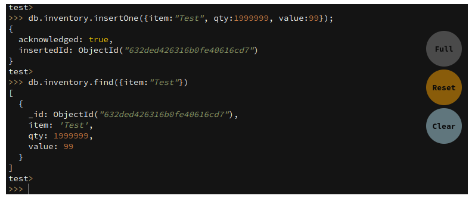
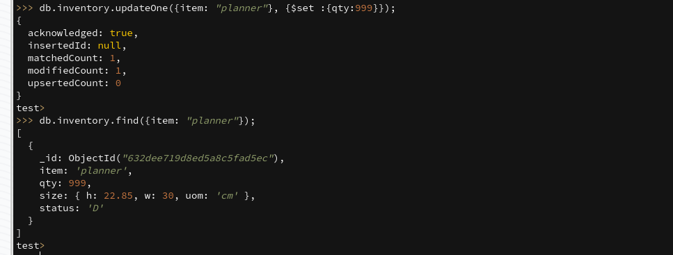
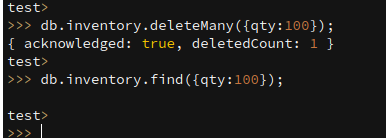
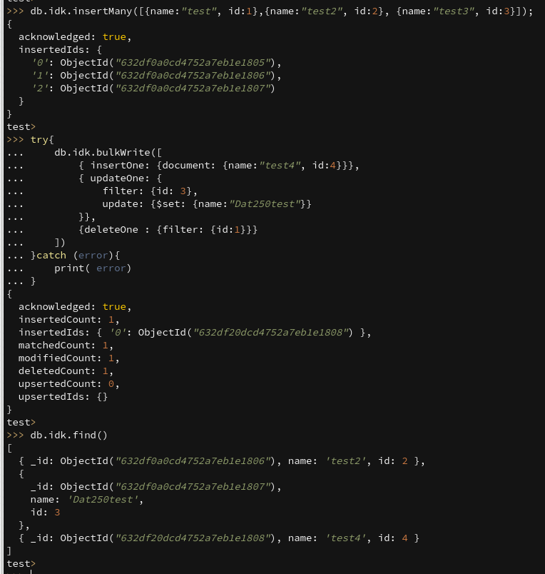
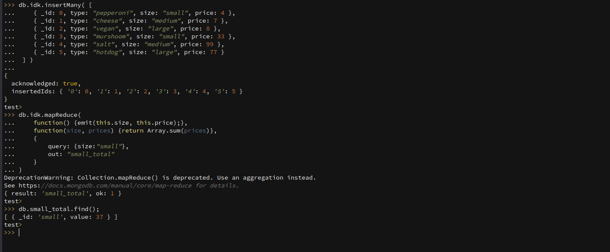

# Technical issues:

Encountered no large technical issues, in the end i just used the live browser environment

# Experiment 1:

Screenshot for insert-documents and for the query:

I assume here that this image displays enough for both parts of this task.

Screenshot for update:

Screenshot for Remove:

Screenshot for Bulk-Write:

# Experiment 2:

The added operation can be seen in the file [mapReduce.js](./mapReduce.js)

Here is a provided screenshot:

In my opinion this operation is not very useful, i am just not very creative when no real requirement for the operation is given.... 

